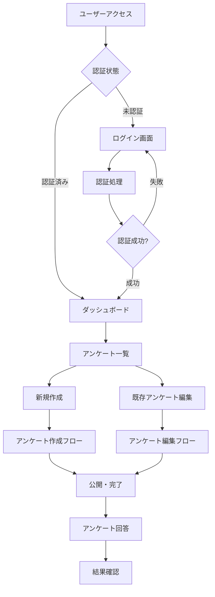
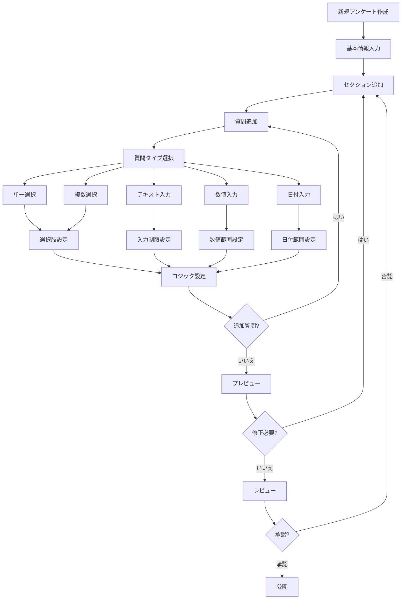
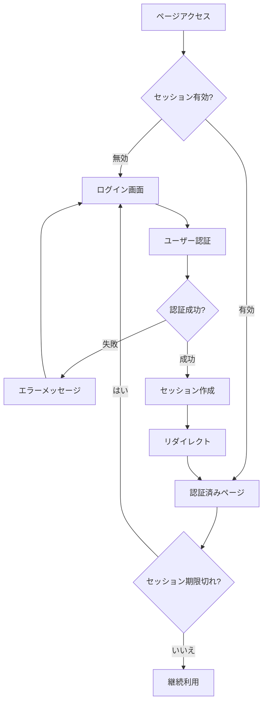
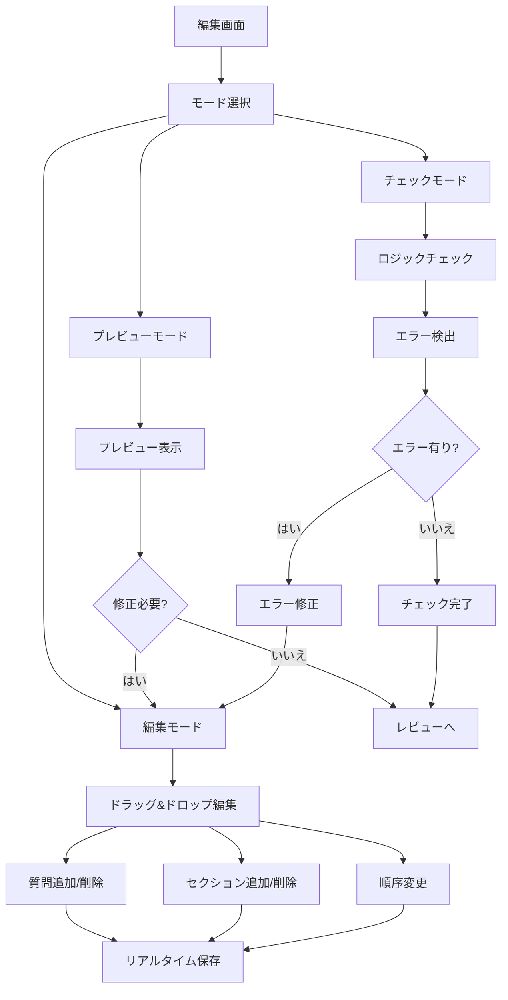
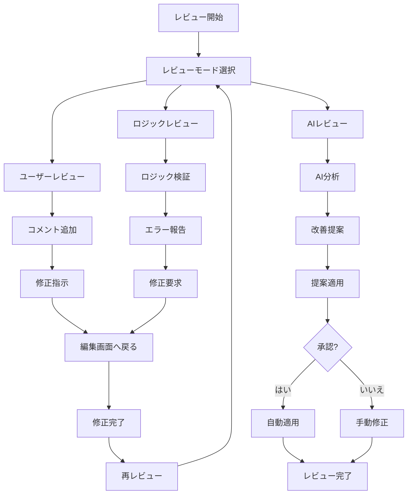
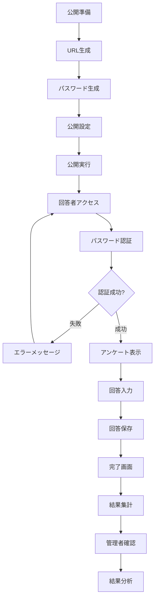
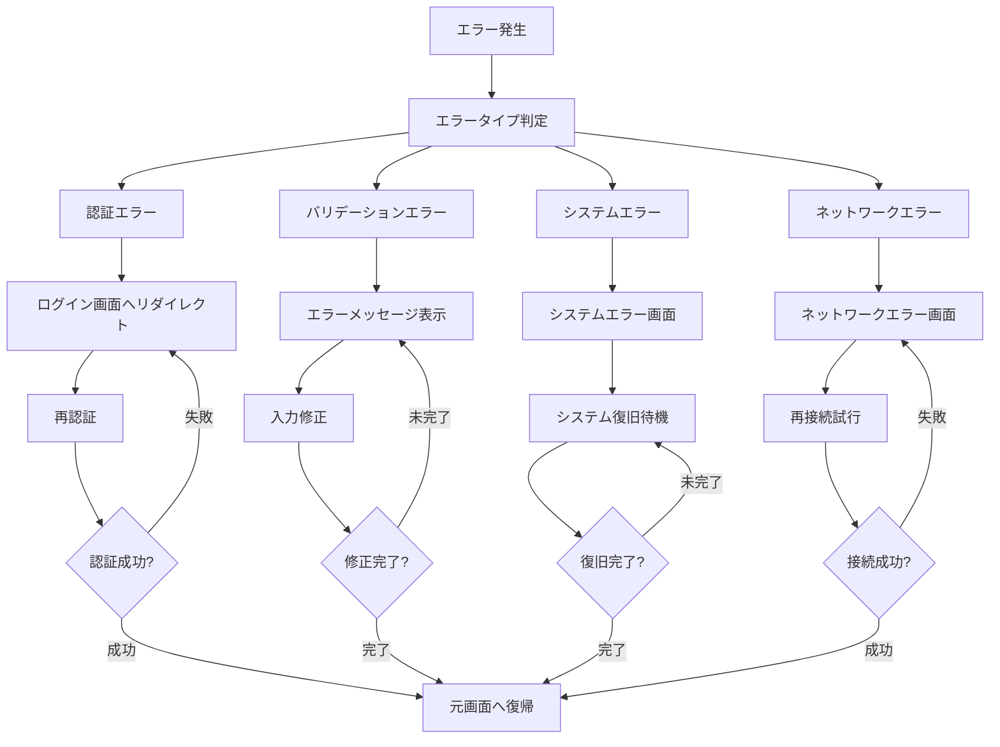
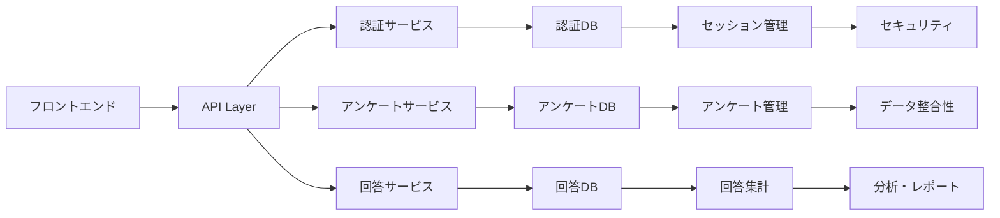
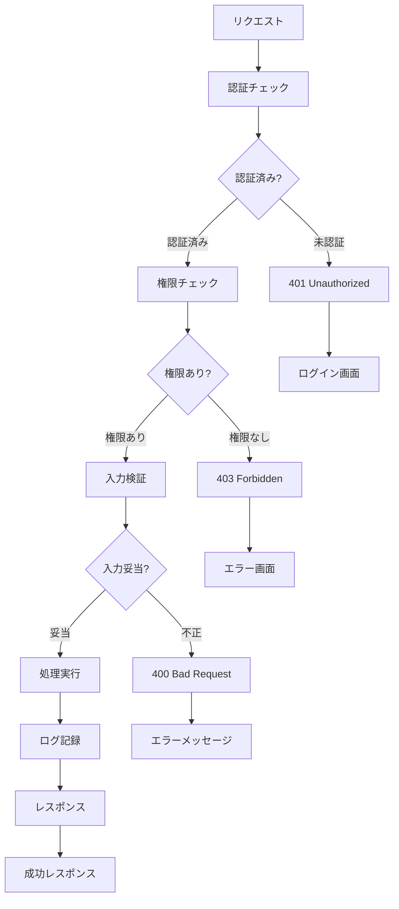
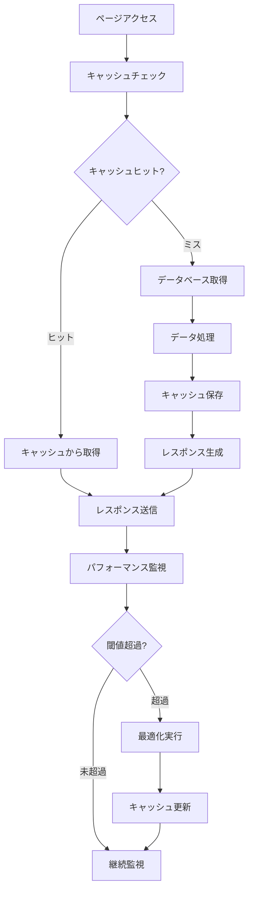

# システムフロー図

## 全体システムフロー

## アンケート作成・編集フロー

## 認証・セッション管理フロー

## アンケート編集モードフロー

## レビュープロセスフロー

## 公開・回答フロー

## エラーハンドリングフロー

## データフロー

## セキュリティフロー

## パフォーマンス最適化フロー

---

## 主要機能一覧

### 認証・セッション管理
- ユーザー認証
- セッション管理
- 権限制御
- セキュリティ

### アンケート作成・編集
- ドラッグ&ドロップ編集
- リアルタイムプレビュー
- ロジックチェック
- バリデーション

### レビュー・承認
- ユーザーレビュー
- AIレビュー
- コメント機能
- 承認ワークフロー

### 公開・回答
- URL生成
- パスワード保護
- 回答収集
- 結果集計

### エラー処理
- エラーハンドリング
- ログ記録
- 復旧処理
- ユーザー通知 